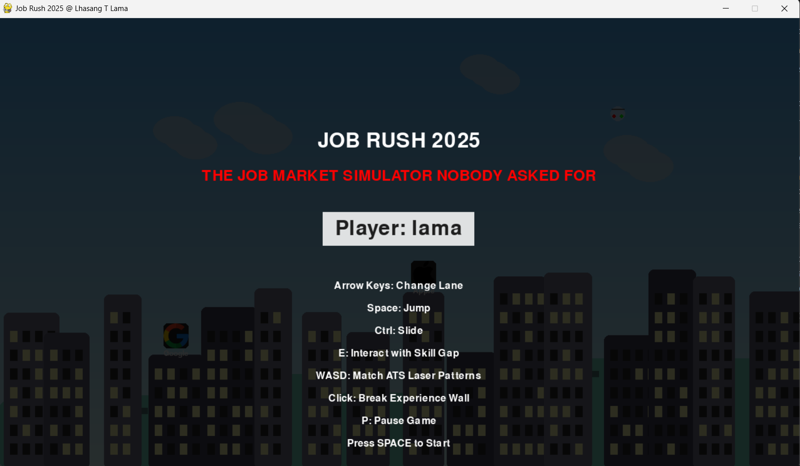
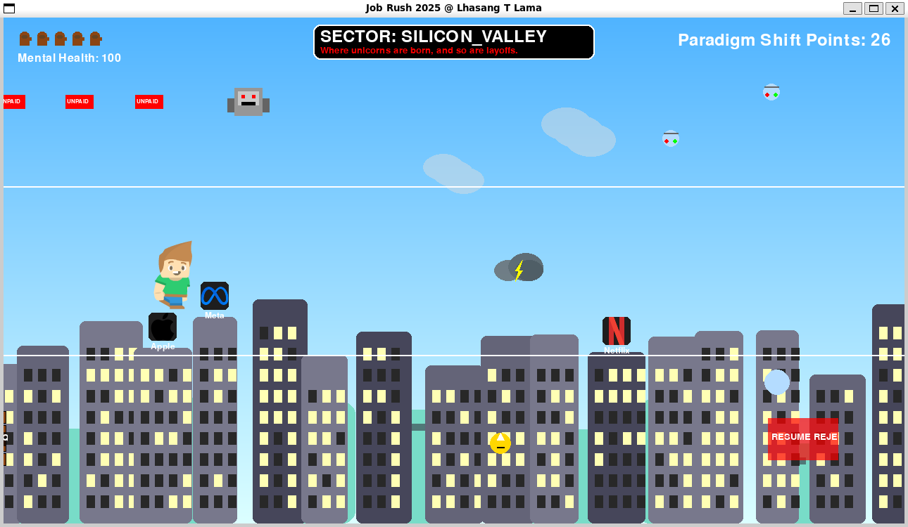
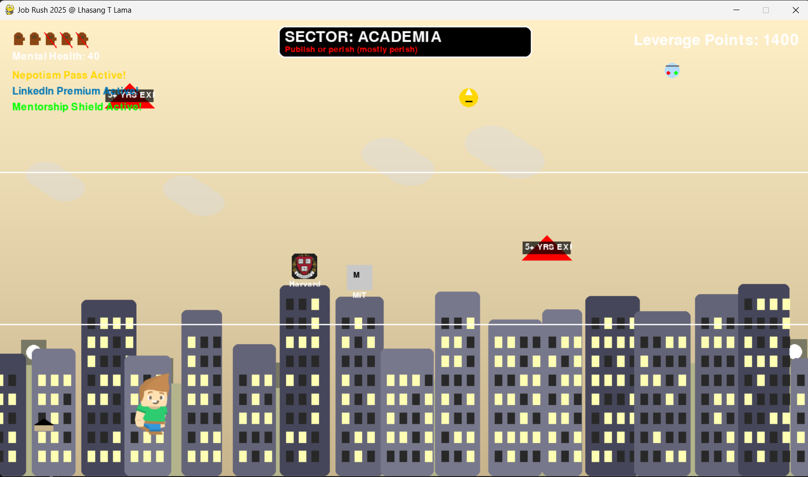
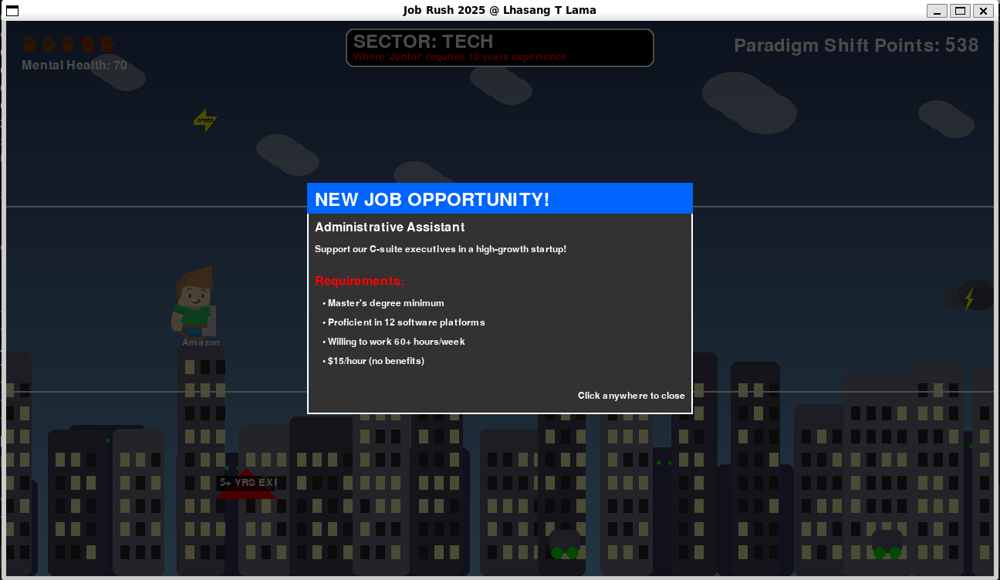
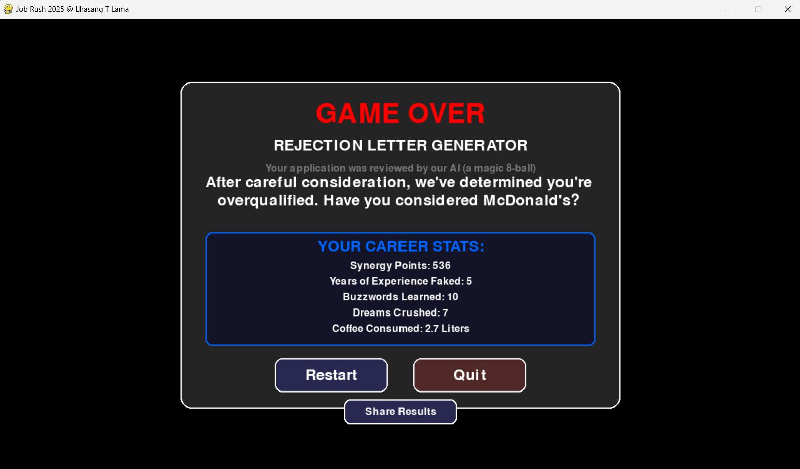

# 🎓 Job Rush 2025

> *A satirical PyGame runner built entirely with Amazon Q CLI, turning job hunting trauma into therapeutic gaming*

[](https://python.org)
[](https://pygame.org)
[](LICENSE)
[](https://aws.amazon.com/q/)

## 📝 Development Blog
Read about the development journey and how this game was built using Amazon Q CLI in my detailed blog post:
[Building Job Rush 2025 with Amazon Q CLI - A Development Journey](https://medium.com/@lamalhasang256/i-built-a-brutally-honest-job-market-game-using-only-ai-prompts-with-amazon-q-cli-and-you-can-too-dece7703f951)

## 🤖 Built with Amazon Q CLI
This entire game was developed using Amazon Q CLI, demonstrating the power of AI-assisted development:
- **Code Generation:** All game components were generated through Amazon Q CLI prompts
- **Architecture Design:** Game structure and patterns suggested by Amazon Q
- **Problem Solving:** Debugging and optimization done through Q CLI interactions
- **Asset Management:** Resource handling and organization guided by Q CLI

## 🎮 Game Overview

Job Rush 2025 is a side-scrolling runner game that humorously depicts the absurdities of modern job hunting. Play as a graduation cap navigating through corporate sectors, dodging unrealistic job requirements, and collecting power-ups while maintaining your mental health.

### 🎯 Core Gameplay
- **Character:** Navigate your graduation cap through the corporate maze
- **Objective:** Survive the corporate obstacle course while maintaining your mental health
- **Mechanics:** Jump, slide, and dodge through three lanes of corporate chaos
- **Progression:** Battle through five unique corporate sectors with increasing difficulty

## ✨ Features

### 🎪 Game Mechanics
- **Three-lane movement system** with smooth controls
- **Dynamic difficulty scaling** based on player progression
- **Mental health meter** visualized as coffee cups
- **Five unique corporate sectors:**
  - Silicon Valley
  - Tech
  - Academia
  - Creative
  - Retail

### 🎭 Satirical Elements
- **Corporate jargon generator** with authentic buzzwords
- **Absurd job requirements** like "10+ years experience with 2-year-old technology"
- **Realistic power-ups** including:
  - Nepotism Pass
  - LinkedIn Premium
  - Mentorship Shield
  - Bootcamp Speed Boost

### 🛠️ Technical Features
- **Particle effects system** for visual polish
- **Parallax scrolling backgrounds** for immersive depth
- **Dynamic audio system** with fallback support
- **Modern popup system** for job postings and rejection letters
- **Smooth 60 FPS gameplay** at 1280x720 resolution

## 🚀 Installation

### Prerequisites
```bash
Python 3.12+
PyGame 2.6.1+
```

### Quick Start
1. Download the latest release from the Releases page
2. Extract the ZIP file
3. Run `Job_Rush.exe`

### Development Setup
```bash
# Clone the repository
git clone https://github.com/mrlhasang20/Job-Rush.git
cd Job-Rush

# Install dependencies
pip install -r requirements.txt

# Run the game
python main_enhanced.py
```

## 🎮 Controls
- **↑/↓** Change lanes
- **SPACE** Jump
- **CTRL** Slide
- **ESC** Pause game
- **P** Toggle pause

## 🏆 Scoring
- Score points by surviving longer
- Collect power-ups for bonus points
- Dodge obstacles to maintain your mental health
- Share your results with #JobRushSurvival

## 🤝 Contributing
Feel free to contribute to this project by:
1. Forking the repository
2. Creating your feature branch
3. Committing your changes
4. Opening a pull request

## 📜 License
This project is licensed under the MIT License - see the [LICENSE](LICENSE) file for details.

## 🙏 Acknowledgments
- Built entirely using Amazon Q CLI
- Powered by PyGame
- Inspired by the real struggles of job seekers everywhere
- Special thanks to all the recruiters who never replied to our applications

## 🛠️ Development Process
This game showcases the capabilities of Amazon Q CLI in game development:
- **Rapid Prototyping:** Quick iteration through Q CLI suggestions
- **Code Quality:** Best practices and patterns recommended by Q
- **Problem Resolution:** Efficient debugging with Q CLI assistance
- **Feature Implementation:** Seamless integration of complex game mechanics

Made with ❤️ and Amazon Q CLI

## 📺 Gameplay Preview
[](your_youtube_video_link_here)

## 📸 Screenshots
<div align="center">
  
  
  
  
  
</div>

